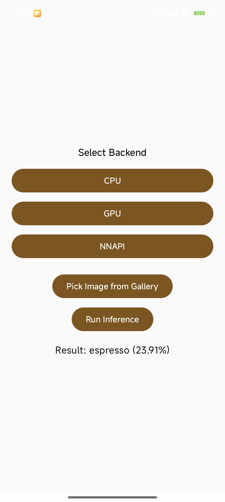

# Android DNN Inference App

An Android application that performs deep neural network inference on images using TensorFlow Lite. The app allows users to classify images using a pre-trained MobileNet v2 model with support for multiple compute backends (CPU, GPU, NNAPI).

## 🚀 Features

- **Image Classification**: Classify images from your gallery using a pre-trained MobileNet v2 model
- **Multiple Backends**: Choose between CPU, GPU, NNAPI, and NPU for inference acceleration
- **1000+ Classes**: Supports ImageNet classification with over 1000 different object classes
- **Modern UI**: Built with Jetpack Compose for a smooth, modern user experience
- **Real-time Results**: Get classification results with confidence scores instantly

## 📱 Screenshots



The app provides a simple interface where you can:
1. Select your preferred inference backend (CPU/GPU/NNAPI/NPU)
2. Pick an image from your device's gallery
3. Run inference and see the classification results with confidence scores

## 🛠 Technologies Used

- **Kotlin** - Primary programming language
- **Jetpack Compose** - Modern Android UI toolkit
- **TensorFlow Lite** - On-device machine learning inference
- **MobileNet v2** - Efficient convolutional neural network for mobile devices
- **GPU Delegate** - Hardware acceleration for faster inference

## 📋 Requirements

- **Android Studio** Arctic Fox or later
- **Android SDK** API level 24+ (Android 7.0)
- **Kotlin** 1.8+
- **Gradle** 8.0+
- **Device Requirements**: Android 7.0+ with at least 2GB RAM

## 🚀 Getting Started

### 1. Clone the Repository

```bash
git clone https://github.com/zhiyuanGH/DNN_Android.git
cd DNN_Android
```

### 2. Open in Android Studio

1. Launch Android Studio
2. Click "Open an Existing Project"
3. Navigate to the cloned repository folder
4. Wait for Gradle sync to complete

### 3. Build and Run

1. Connect an Android device or start an emulator
2. Click the "Run" button (green triangle) in Android Studio
3. The app will be installed and launched on your device

### 4. Using the App

1. **Select Backend**: Choose between CPU, GPU, NNAPI, or NPU
2. **Pick Image**: Tap "Pick Image from Gallery" to select a photo
3. **Run Inference**: Tap "Run Inference" to classify the selected image
4. **View Results**: See the predicted class and confidence score

## 🏗 Project Structure

```
app/
├── src/main/
│   ├── assets/
│   │   ├── mobilenet_v2_1.0_224.tflite    # Pre-trained model
│   │   └── labels.txt                      # Class labels (1000+ classes)
│   ├── java/com/example/dnninference/
│   │   ├── MainActivity.kt                 # Main UI and app logic
│   │   ├── Classifier.kt                   # TensorFlow Lite inference engine
│   │   └── ui/theme/                       # Compose UI theme
│   └── res/                                # Android resources
├── build.gradle.kts                        # App-level dependencies
└── proguard-rules.pro                      # Code obfuscation rules
```

## 🔧 Development Guide

### Adding a New Model

1. **Prepare your model**: Convert it to TensorFlow Lite format (.tflite)
2. **Add model file**: Place the .tflite file in `app/src/main/assets/`
3. **Update labels**: Create/update the labels.txt file with your model's classes
4. **Modify Classifier**: Update the `Classifier.kt` file:
   ```kotlin
   class Classifier(
       private val context: Context,
       private val modelPath: String = "your_model.tflite", // Update this
       private val labelPath: String = "your_labels.txt",   // Update this
       // ...
   )
   ```

### Customizing Image Preprocessing

The current implementation uses MobileNet v2 preprocessing (224x224, normalized to [-1,1]). To modify for your model:

```kotlin
// In Classifier.kt, modify the ImageProcessor
val imageProcessor = ImageProcessor.Builder()
    .add(ResizeOp(your_input_size, your_input_size, ResizeOp.ResizeMethod.BILINEAR))
    .add(NormalizeOp(your_mean, your_std)) // Adjust normalization
    .build()
```

### Adding New Backends

To support additional compute backends:

1. **Update Backend enum**:
   ```kotlin
   enum class Backend { CPU, GPU, NNAPI, NPU } // Add new backend
   ```

2. **Modify initialization**:
   ```kotlin
   when (backend) {
       Backend.GPU -> options.addDelegate(GpuDelegate())
       Backend.NNAPI -> options.addDelegate(NnApiDelegate())
       Backend.NPU -> options.addDelegate(NpuDelegate()) // Custom NPU delegate
       else -> { /* CPU - no delegate needed */ }
   }
   ```

### NPU Backend Support (Needed Feature)

**Status**: 🚧 **In Development**

NPU (Neural Processing Unit) support is a planned feature to leverage dedicated AI chips for ultra-fast inference:

- **Target Hardware**: Devices with dedicated NPU/AI chips (e.g., Snapdragon with Hexagon DSP, MediaTek APU, Samsung NPU)
- **Expected Performance**: 2-5x faster than GPU inference with lower power consumption
- **Implementation Needed**: 
  - Custom NPU delegate integration
  - Hardware-specific optimization
  - Fallback mechanisms for unsupported devices

**Contribution Welcome**: If you have experience with NPU programming or access to NPU-enabled devices, contributions are highly appreciated!


## 🤝 Contributing

1. Fork the repository
2. Create a feature branch (`git checkout -b feature/amazing-feature`)
3. Commit your changes (`git commit -m 'Add amazing feature'`)
4. Push to the branch (`git push origin feature/amazing-feature`)
5. Open a Pull Request

## 📝 License

This project is open source and available under the [MIT License](LICENSE).

---

**Happy coding! 🎉** 